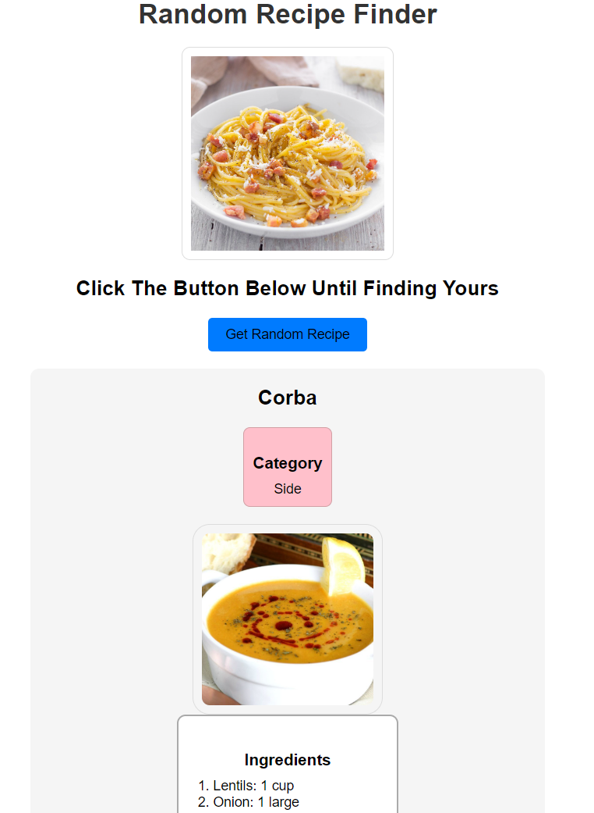
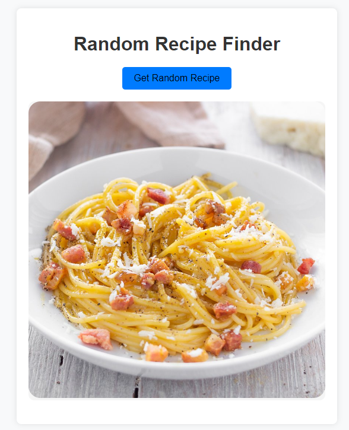

# assignment-module-3

# ABOUT MY ASSIGNMENT :cat: :dog: 

The `app.js` file is the core JavaScript file for the Random Recipe Finder application. It contains the logic for fetching and displaying a random recipe from TheMealDB API. Here's a breakdown of the file's content:

1. **fetchRandomRecipe()**: This function fetches a random recipe from TheMealDB API using the Fetch API. It handles errors and returns the fetched recipe data or null if there's an error.
2. **displayRecipe()**: This function takes the fetched recipe data and displays it on the page. It sets the recipe title, category, image, ingredients, instructions, and YouTube video link (if available).
3. **onRandomRecipe()**: This function is called when the "Get Random Recipe" button is clicked. It fetches a random recipe using `fetchRandomRecipe()` and then displays it using `displayRecipe()`.
4. **Event Listener**: The `onRandomRecipe()` function is bound to the "Get Random Recipe" button's click event, allowing the user to trigger the recipe fetching and display process.

The file uses modern JavaScript features like async/await for handling asynchronous operations and DOM manipulation to dynamically update the page content.

## here some view of the random recipe view

click here for check the assignment progress https://beautiful-daifuku-43e243.netlify.app/

##here the looks **[CLICK HERE](https://beautiful-daifuku-43e243.netlify.app/)**

